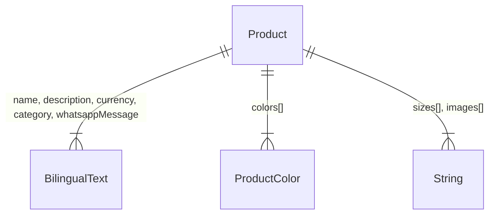

# Data Model: i18n & Content Foundation

**Branch**: `002-i18n-content-foundation` | **Date**: 2026-02-21

## Entities

### Product

The central entity — already defined in `src/data/products.ts` from Phase 1.

| Field | Type | Required | Description |
|-------|------|----------|-------------|
| `id` | `string` | Yes | Unique identifier (e.g., `"prod-001"`) |
| `slug` | `string` | Yes | URL-friendly ID for routing (e.g., `"classic-winter-abaya"`) |
| `name` | `BilingualText` | Yes | Product name in AR and EN |
| `description` | `BilingualText` | Yes | Product description in AR and EN |
| `price` | `number` | Yes | Price in AED (numeric, no currency symbol) |
| `currency` | `BilingualText` | Yes | Currency display label (`{ ar: "د.إ", en: "AED" }`) |
| `category` | `BilingualText` | Yes | Category name (`شتوي/Winter` or `صيفي/Summer`) |
| `sizes` | `string[]` | Yes | Available sizes (subset of `["S", "M", "L", "XL", "XXL"]`) |
| `colors` | `ProductColor[]` | Yes | Available color options (min 2) |
| `images` | `string[]` | Yes | Image URLs (portrait 3:4, min 1) |
| `featured` | `boolean` | Yes | Appears in homepage featured section |
| `whatsappMessage` | `BilingualText` | Yes | Pre-filled WhatsApp message template |

**Uniqueness**: `id` and `slug` are both unique across all products.

**Constraints**:
- `price` must be > 0
- `sizes` must be non-empty
- `colors` must contain at least 1 entry
- `images` must contain at least 1 URL
- `category` must be one of: `{ ar: "شتوي", en: "Winter" }` or `{ ar: "صيفي", en: "Summer" }`

### BilingualText

Supporting type for all bilingual string fields.

| Field | Type | Required | Description |
|-------|------|----------|-------------|
| `ar` | `string` | Yes | Arabic text |
| `en` | `string` | Yes | English text |

### ProductColor

Supporting type for color options.

| Field | Type | Required | Description |
|-------|------|----------|-------------|
| `name` | `string` | Yes | Display name (e.g., `"Black"`, `"أسود"`) |
| `hex` | `string` | Yes | Hex color code (e.g., `"#000000"`) |

## Relationships



- Product → BilingualText: One-to-many (5 bilingual fields)
- Product → ProductColor: One-to-many (2+ colors per product)
- Product → String arrays: sizes and images are plain string arrays

## Translation Bundle Structure

The translation files (`messages/ar.json`, `messages/en.json`) use the following key hierarchy:

```text
root
├── app                    # App-level metadata
│   ├── title
│   └── description
├── announcement           # Announcement bar (single string)
├── nav                    # Navigation
│   ├── home
│   ├── collections
│   ├── sizeGuide
│   └── contact
├── hero                   # Hero slider
│   ├── slide1 { title, subtitle, cta }
│   ├── slide2 { title, subtitle, cta }
│   └── slide3 { title, subtitle, cta }
├── product                # Product-related labels
│   ├── orderNow
│   ├── inquire
│   ├── selectSize
│   ├── selectColor
│   ├── currency
│   ├── featured
│   └── noProducts
├── about                  # About section
│   ├── title
│   └── body
├── collections            # Collections page
│   ├── title
│   ├── filterAll
│   └── noProducts
├── sizeGuide              # Size guide page
│   ├── title
│   ├── measurementGuide
│   ├── headers { size, length, chest, waist }
│   └── cta
├── contact                # Contact page
│   ├── title
│   ├── whatsapp
│   ├── phone
│   ├── email
│   ├── instagram
│   ├── tiktok
│   └── snapchat
├── returns                # Returns & shipping page
│   ├── title
│   ├── freeShipping
│   ├── shippingPolicy
│   └── returnsPolicy
├── footer                 # Footer
│   ├── tagline
│   ├── quickLinks
│   ├── socialTitle
│   ├── contactTitle
│   └── rights
└── common                 # Shared across pages
    ├── loading
    ├── error
    ├── back
    └── viewAll
```

**Consistency Rule**: Both `ar.json` and `en.json` MUST have identical key structures. A missing key in either file is a defect.

## State & Lifecycle

Products are **static** — no state transitions. Data is read-only at runtime, authored at build time.

Translation bundles are loaded per-request by `next-intl` based on the locale segment in the URL. No caching or invalidation logic is needed.

## Placeholder Product Distribution

| # | Slug | Category | Featured | Price Range |
|---|------|----------|----------|-------------|
| 1 | `winter-elegance-abaya` | شتوي / Winter | ✅ | 650–850 AED |
| 2 | `winter-velvet-abaya` | شتوي / Winter | ❌ | 750–950 AED |
| 3 | `winter-wool-abaya` | شتوي / Winter | ✅ | 500–700 AED |
| 4 | `summer-breeze-abaya` | صيفي / Summer | ✅ | 350–550 AED |
| 5 | `summer-linen-abaya` | صيفي / Summer | ❌ | 400–600 AED |
| 6 | `summer-silk-abaya` | صيفي / Summer | ✅ | 600–800 AED |

> Exact names, descriptions, and prices will be finalized during implementation. This table provides the distribution plan.
