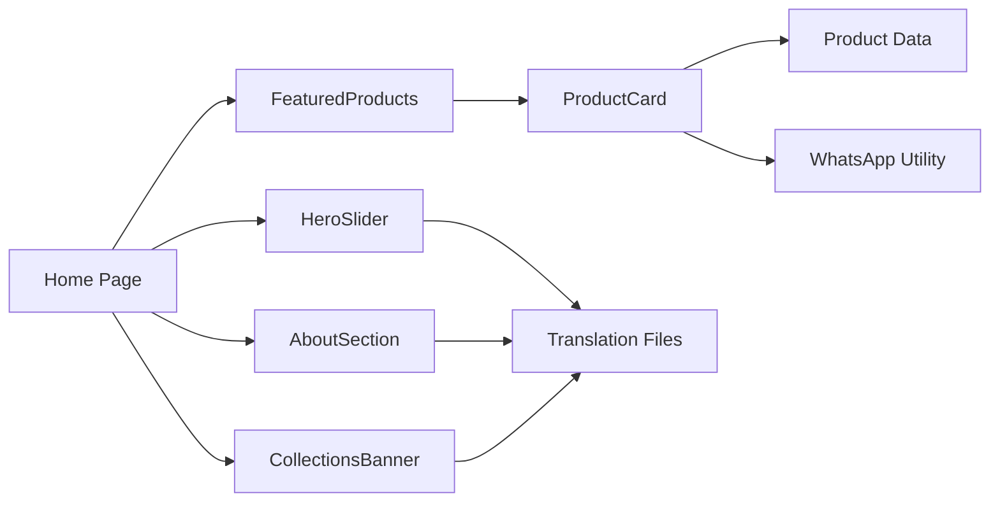

# Data Model: Home Page (004-home-page)

**Date**: 2026-02-22  
**Source**: Feature spec + `src/data/products.ts` (existing)

## Entities

### HeroSlide

Represents one slide in the hero slider. Data is sourced from translation files (`messages/ar.json` and `messages/en.json`), not from a data file.

| Field | Type | Source | Notes |
|-------|------|--------|-------|
| id | number | Implicit (index) | Slide position (0, 1, 2) |
| title | string | `hero.slide{N}.title` | Bilingual via next-intl |
| subtitle | string | `hero.slide{N}.subtitle` | Bilingual via next-intl |
| cta | string | `hero.slide{N}.cta` | Button label, bilingual |
| ctaLink | string | Hardcoded `/collections` | Same for all slides |
| image | string | `/public/images/hero/slide-{N}.webp` | Local image path |

**Total slides**: 3 (fixed)

---

### Product (existing — used for FeaturedProducts)

Already defined in `src/data/products.ts`. The Home page uses a subset:

| Field | Used By Home Page | Notes |
|-------|-------------------|-------|
| id | ✗ | Not displayed, internal |
| slug | ✓ | Card navigation link |
| name | ✓ | `name[locale]` displayed on card |
| description | ✗ | Not shown on card |
| price | ✓ | Shown in champagne gold |
| currency | ✓ | `currency[locale]` for display |
| category | ✓ | Badge on card |
| sizes | ✗ | Not shown on card |
| colors | ✗ | Not shown on card |
| images | ✓ | `images[0]` for card thumbnail |
| featured | ✓ | **Filter criterion**: `featured: true` |
| whatsappMessage | ✗ | Not used directly; `whatsapp.ts` builds message |

**Featured count**: Spec requires 6. Currently 4 products have `featured: true`. Needs update.

**Distribution**:
- Current featured: prod-001, prod-003, prod-004, prod-006
- Needed: Set prod-002 and prod-005 to `featured: true`

---

### AboutContent

Data sourced entirely from translation files.

| Field | Type | Source |
|-------|------|--------|
| title | string | `about.title` |
| body | string | `about.body` |
| image | string | `/public/images/about.webp` |

---

### CollectionsBanner

Data sourced from translation files + static image.

| Field | Type | Source |
|-------|------|--------|
| overlayText | string | Translation key (new: `collections.bannerText`) |
| cta | string | Translation key (new: `collections.bannerCta`) |
| ctaLink | string | Hardcoded `/collections` |
| image | string | `/public/images/collections-banner.webp` |

## New Translation Keys Required

The following keys need to be added to `messages/ar.json` and `messages/en.json`:

| Key | EN Value | AR Value |
|-----|----------|----------|
| `home.featuredTitle` | `Featured Designs` | `أبرز التصاميم` |
| `collections.bannerText` | `Discover All Collections` | `اكتشفي كل المجموعات` |
| `collections.bannerCta` | `View Collections` | `تصفحي المجموعات` |

## Relationships



## State Transitions

### HeroSlider State

```
IDLE → AUTO_PLAYING → (timer fires) → TRANSITIONING → IDLE
IDLE → (user clicks arrow/dot) → TRANSITIONING → IDLE (auto-play timer resets)
```

No persistent state. Auto-play timer resets on manual interaction. Current slide index is ephemeral component state.
